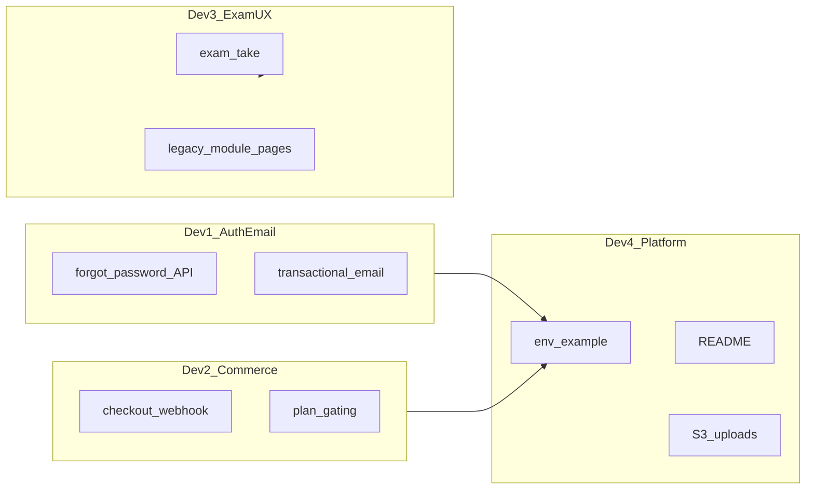

# Developer task split — IELTS prep platform (ielts-v1)

**Source of truth for parallel work across four developers.**  
**চার জন ডেভেলপারের প্যারালেল কাজের মূল নথি।**

---

## Quick start / দ্রুত শুরু

**English:** Clone the repo, install dependencies, copy environment variables (see Developer 4 — add `.env.example`), then:

```bash
npm install
npm run dev      # local dev server
npm run build    # production build (must pass before release)
npm run lint     # ESLint
```

**Bangla:** রিপো ক্লোন করুন, `npm install` চালান, এনভায়রনমেন্ট ভেরিয়েবল সেট করুন (ডেভেলপার ৪-এর `.env.example` দেখুন), তারপর উপরের কমান্ডগুলো ব্যবহার করুন।

---

## Definition of Done (shared) / সমাপ্তির সংজ্ঞা (সবাই মিলিয়ে)

**English — all four developers must agree these are green before we call the product “launch-complete”:**

1. `npm run build` succeeds; `npm run lint` is clean or only has agreed exceptions.
2. **Critical user paths work on staging:** sign up / log in → browse tests → open `/exam/take?testId=…` → answer → submit → open results (`src/app/exam/results/page.tsx`).
3. **Commerce path:** checkout → Stripe success → webhook updates subscription (verify in DB).
4. **Admin path:** admin creates or publishes a test with sections/questions → learner sees it and can take it.
5. **Security:** production API does **not** return password-reset links or other dev-only secrets in JSON responses.

**Bangla — লঞ্চের আগে এইগুলো সবাই মিলে চেক করবেন:**

1. `npm run build` ও `npm run lint` ঠিক আছে কিনা।
2. **ইউজার ফ্লো:** সাইন আপ/লগইন → টেস্ট লিস্ট → `/exam/take` দিয়ে পরীক্ষা → সাবমিট → রেজাল্ট পেজ।
3. **পেমেন্ট:** চেকআউট → স্ট্রাইপ → ওয়েবহুক দিয়ে সাবস্ক্রিপশন আপডেট।
4. **অ্যাডমিন:** টেস্ট তৈরি/পাবলিশ → লার্নার দেখতে ও দিতে পারে।
5. **নিরাপত্তা:** প্রোডাকশনে পাসওয়ার্ড রিসেট লিংক API রেসপন্সে ফিরবে না।

**Out of scope unless product owner adds them / পণ্য মালিক না বললে স্কোপের বাইরে:**

Extra payment methods (beyond Stripe card flow), full E2E automation suite, advanced analytics dashboards — document separately if needed.

---

## Architecture note / আর্কিটেকচার নোট

**English:** The **real** exam is driven by the API in `src/app/exam/take/page.tsx` (loads `Test`, `Section`, question groups). Routes like `/exam/listening`, `/exam/reading`, `/exam/writing`, `/exam/speaking` are **legacy/demo** UIs (e.g. hardcoded audio, chart placeholder) and must not be confused with production flow.

**Bangla:** আসল পরীক্ষা `src/app/exam/take/page.tsx` এ API দিয়ে চলে। `/exam/listening` ইত্যাদি পুরনো/ডেমো পেজ — এগুলো প্রোডাকশন ফ্লো নয়।



---

## Developer 1 — Auth & email / অথ ও ইমেইল

**English — scope:**

- Implement **transactional email** for password reset (choose one: Resend, SendGrid, Nodemailer + SMTP, etc.).
- **Fix existing behaviour** in `src/app/api/auth/forgot-password/route.ts`:
  - Replace `TODO` with real email send.
  - Do **not** log full reset URLs in production.
  - Return `resetLink` in JSON **only** in development (e.g. `NODE_ENV === "development"`) or behind an explicit `ALLOW_DEV_RESET_LINK` flag; production must return the same generic success message for all emails.
- Align public URL variables: today forgot-password uses `NEXT_PUBLIC_BASE_URL` while Stripe checkout uses `NEXT_PUBLIC_APP_URL` in `src/app/api/stripe/checkout/route.ts`. **Pick one canonical name** (or document both with the same value) so links never point to the wrong host.
- Update `src/app/(main)/forgot-password/page.tsx` so `devLink` only appears in dev, matching the API.

**Bangla — কাজের সীমা:**

- পাসওয়ার্ড রিসেট ইমেইল আসল প্রোভাইডার দিয়ে পাঠান।
- `forgot-password` API তে `TODO` সরিয়ে ইমেইল ইমপ্লিমেন্ট করুন; প্রোডাকশনে লিংক লগ বা JSON এ ফেরাবেন না।
- `NEXT_PUBLIC_BASE_URL` vs `NEXT_PUBLIC_APP_URL` এক করুন বা ডকুমেন্ট করুন।
- ফরগট-পাসওয়ার্ড UI তে `devLink` শুধু ডেভ এ দেখান।

**Acceptance / গ্রহণযোগ্যতা:** Reset works end-to-end in staging with real inbox; production response has no `resetLink`; no sensitive logs.

---

## Developer 2 — Commerce & access / কমার্স ও অ্যাক্সেস

**English — scope:**

- End-to-end verify **Stripe**: `src/app/api/stripe/checkout/route.ts` + `src/app/api/stripe/webhook/route.ts` — document webhook URL, signing secret (`STRIPE_WEBHOOK_SECRET`), and which events are handled.
- Validate **plan gating** in `src/app/api/tests/route.ts` matches business rules: guest vs logged-in vs active subscription / trial.
- Optional UI: `src/app/(main)/checkout/page.tsx` — decide whether to remove, hide, or keep “More Payment Options Coming Soon” until a second method exists.

**Bangla — কাজের সীমা:**

- স্ট্রাইপ চেকআউট ও ওয়েবহুক স্টেজিং/প্রোডে পুরো ফ্লো টেস্ট করুন।
- `tests` API তে প্ল্যান অনুযায়ী কে কোন টেস্ট দেখতে পারে — বিজনেস রুল মিলিয়ে নিন।
- চেকআউট পেজের “Coming Soon” অংশ রাখা/তোলার সিদ্ধান্ত নিন।

**Acceptance / গ্রহণযোগ্যতা:** Documented webhook setup; happy-path payment updates `Subscription` in MongoDB; test list visibility matches agreed rules.

---

## Developer 3 — Exam UX consistency / পরীক্ষা UX একসূত্রে করা

**English — scope:**

- **Decision (team lead signs off — see checklist below):**  
  - Option A: Redirect `/exam/listening`, `/exam/reading`, `/exam/writing`, `/exam/speaking` → `/exam` or `/exam/take` (with query params if needed).  
  - Option B: Remove routes after confirming no bookmarks or marketing links use them.
- **Writing visuals:** In the **take** flow, ensure Task 1 charts/diagrams use CMS data (`imageUrl`, `passageImage`, section fields) instead of relying on the placeholder in `src/app/exam/writing/page.tsx` (that file is demo-only unless repurposed).
- **Listening demo audio:** `src/app/exam/listening/page.tsx` uses a hardcoded SoundHelix URL — not acceptable as “real” content; align with admin-uploaded audio from sections.
- **ExamContext:** `src/components/exam/ExamContext.tsx` — `finishModule` is a stub; either wire navigation to the next module/results or remove dead code after confirming no consumer depends on it.

**Bangla — কাজের সীমা:**

- পুরনো `/exam/...` মডিউল রুট রিডাইরেক্ট বা ডিলিট — টিম লিড সিদ্ধান্ত।
- আসল `/exam/take` ফ্লো তে রাইটিং চার্ট/ইমেজ ডাটাবেজ থেকে আসবে।
- লিসেনিং ডেমো MP3 প্রোডাকশন কনটেন্ট হিসেবে ব্যবহার করবেন না।
- `ExamContext.finishModule` ইমপ্লিমেন্ট বা অপ্রয়োজনীয় কোড সরান।

**Acceptance / গ্রহণযোগ্যতা:** No user path accidentally lands on demo-only exam pages; take flow shows real section media; context API is coherent.

---

## Developer 4 — Platform, media, AI, docs / প্ল্যাটফর্ম, মিডিয়া, AI, ডকুমেন্টেশন

**English — scope:**

- Add **`.env.example`** at repo root (no secrets) listing at least:
  - `MONGO_URI`
  - `NEXTAUTH_SECRET`
  - `GOOGLE_CLIENT_ID`, `GOOGLE_CLIENT_SECRET` (if Google login enabled)
  - `NEXT_PUBLIC_BASE_URL` or `NEXT_PUBLIC_APP_URL` (document chosen convention from Dev 1)
  - `STRIPE_SECRET_KEY`, `STRIPE_WEBHOOK_SECRET`
  - `AWS_ACCESS_KEY_ID`, `AWS_SECRET_ACCESS_KEY`, `AWS_BUCKET_NAME`, `AWS_BUCKET_REGION`
  - `OPENAI_API_KEY`
- Replace template `README.md` with: what the app is, how to run, env setup, Stripe webhook note, S3 upload expectations (`src/lib/s3Upload.ts`, admin section audio), and where admin AI features live (`src/app/api/ai/generate-questions/route.ts`, `src/lib/aiEvaluation.ts`).
- Smoke-test uploads: `src/app/api/upload/route.ts`, admin flows that attach audio/images.
- Document behaviour when OpenAI is missing or rate-limited (clear errors for admins/learners).

**Bangla — কাজের সীমা:**

- `.env.example` যোগ করুন (সিক্রেট ছাড়া)।
- `README.md` আপডেট — প্রোডাক্ট বর্ণনা, চালানোর ধাপ, Stripe/S3/OpenAI নোট।
- আপলোড ও অ্যাডমিন অডিও পাথ টেস্ট করুন।
- OpenAI না থাকলে কী মেসেজ/এরর দেখাবে — লিখে রাখুন।

**Acceptance / গ্রহণযোগ্যতা:** New developer can onboard from README + `.env.example`; uploads work with valid AWS config.

---

## Already built — verify & how to fix / আগে করা কাজ — যাচাই ও ঠিক করার উপায়

| Symptom (EN) | লক্ষণ (BN) | Likely cause | Key files | Fix approach (EN) | সমাধান ধাপ (BN) |
|--------------|------------|--------------|-----------|-------------------|------------------|
| Reset email never arrives; API returns `resetLink` | রিসেট মেইল আসে না; API তে লিংক | Email not implemented; dev response | `src/app/api/auth/forgot-password/route.ts`, `src/app/(main)/forgot-password/page.tsx` | Integrate mailer; strip `resetLink` in prod; fix `NEXT_PUBLIC_*` URL | মেইলার যোগ করুন; প্রোডে লিংক বন্ধ করুন |
| Exam audio/content feels “fake” | অডিও/কনটেন্ট ডেমো মনে হয় | Using legacy `/exam/listening` not `/exam/take` | `src/app/exam/listening/page.tsx`, `src/app/exam/take/page.tsx` | Redirect users to take flow; use `section.audioUrl` from DB | `/exam/take` এ নিয়ে যান; DB অডিও ব্যবহার করুন |
| Writing chart missing | রাইটিং চার্ট নেই | Demo page placeholder vs real data | `src/app/exam/writing/page.tsx`, take page section rendering | Render `imageUrl` / `passageImage` from API in take flow | API থেকে ইমেজ ফিল্ড দেখান |
| File upload fails | ফাইল আপলোড ফেইল | Missing or wrong AWS env / bucket policy | `src/lib/s3.ts`, `src/lib/s3Upload.ts`, `src/app/api/upload/route.ts` | Set keys + bucket CORS/policy; verify region | AWS কী ও বাকেট পলিসি ঠিক করুন |
| AI returns 401/500 | AI এরর | Missing key, quota, or non-admin | `src/lib/aiEvaluation.ts`, `src/app/api/ai/generate-questions/route.ts` | Set `OPENAI_API_KEY`; check role for admin routes | API কী ও অ্যাডমিন রোল চেক করুন |
| Wrong return URL after payment | পেমেন্ট পরে ভুল URL | `NEXT_PUBLIC_APP_URL` mismatch | `src/app/api/stripe/checkout/route.ts` | Set env to public site URL | পাবলিক সাইট URL এনভে সেট করুন |

---

## Weekly sync & handoffs / সাপ্তাহিক সিঙ্ক

**English:** Developer 1 and 4 own **env naming and documentation** — sync once so `README` and `.env.example` match the chosen `NEXT_PUBLIC_*` convention. Developer 2 and 3 both affect **who sees which tests** — align subscription rules with exam entry points (dashboard links vs direct `/exam`).

**Bangla:** ডেভ ১ ও ৪ এনভি/ডক একসাথে মিলিয়ে নিন। ডেভ ২ ও ৩ সাবস্ক্রিপশন ও পরীক্ষা প্রবেশ পথ একসাথে দেখুন।

---

## Team lead — cross-review checklist / টিম লিড — চূড়ান্ত চেকলিস্ট

_Use this to close the “cross-review” todo and lock launch scope._

**English:**

- [ ] **Public URL:** Single documented variable (`NEXT_PUBLIC_APP_URL` or `NEXT_PUBLIC_BASE_URL`) for reset links, Stripe return URLs, and any absolute links.
- [ ] **Legacy exam routes:** Decision recorded (redirect vs delete) and implemented by Developer 3.
- [ ] **Password reset:** Production behaviour reviewed (no link leak, email delivered).
- [ ] **Stripe:** Webhook secret and events verified on staging.
- [ ] **Optional scope:** “More payment options” and full E2E tests explicitly in or out of launch.

**Bangla:**

- [ ] পাবলিক URL এক নিয়মে ঠিক আছে কিনা।
- [ ] পুরনো `/exam/...` রুটের সিদ্ধান্ত লিখে ইমপ্লিমেন্ট হয়েছে কিনা।
- [ ] পাসওয়ার্ড রিসেট প্রোডাকশন-সেফ কিনা।
- [ ] Stripe ওয়েবহুক ঠিক আছে কিনা।
- [ ] অপশনাল ফিচার লঞ্চে আছে কি নেই — স্পষ্ট।

---

## File reference index / গুরুত্বপূর্ণ ফাইল

| Area | Path |
|------|------|
| Exam take (production flow) | `src/app/exam/take/page.tsx` |
| Exam index / redirect | `src/app/exam/page.tsx` |
| Legacy module demos | `src/app/exam/listening/page.tsx`, `reading`, `writing`, `speaking` |
| Results | `src/app/exam/results/page.tsx` |
| Forgot password API | `src/app/api/auth/forgot-password/route.ts` |
| Tests list & gating | `src/app/api/tests/route.ts` |
| Stripe | `src/app/api/stripe/checkout/route.ts`, `webhook/route.ts` |
| S3 | `src/lib/s3.ts`, `src/lib/s3Upload.ts` |
| Mongo | `src/lib/mongodb.ts` |
| AI | `src/lib/aiEvaluation.ts`, `src/app/api/ai/generate-questions/route.ts` |
| Auth session | `src/app/api/auth/[...nextauth]/route.ts` |

---

_End of document. Update this file when scope or owners change._  
_নথির শেষ। স্কোপ বা দায়িত্ব বদলালে এ ফাইল আপডেট করুন।_
